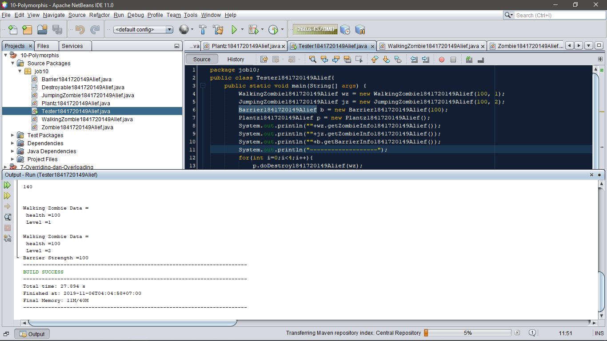

# Laporan Praktikum #10 - Polimorfisme

## Kompetensi
*Setelah melakukan percobaan pada jobsheet ini, diharapkan mahasiswa mampu* :

a.	Memahami konsep dan bentuk dasar polimorfisme

b.	Memahami konsep virtual method invication

c.	Menerapkan polimorfisme pada pembuatan 
heterogeneous collection

d.	Menerapkan polimorfisme pada parameter/argument method

e.	Menerapkan object casting untuk meng-ubah bentuk objek

## Ringkasan Materi
>Polimorfisme bisa digunakan untuk mewariskan super class ke dalam sub class dalam berbagai bentuk yang beragam. Super class bisa diinstansiasi objek sebagai sub class dan memiliki relasi inheritance (IS-A).

## Percobaan

### Praktikum Percobaan 1
1.Class apa sajakah yang merupakan turunan dari class Employee?

>Jawaban : InternshipEmployee dan PermanentEmployee.

2.Class apa sajakah yang implements ke interface Payable?
>Jawaban : PermanentEmployee dan ElectricityBill.

3.Perhatikan class Tester1, baris ke-10 dan 11. Mengapa e, bisa diisi dengan objek pEmp (merupakan objek dari class PermanentEmployee) dan objek iEmp (merupakan objek dari class InternshipEmployee) ?

>Jawaban : Karena e pada objek  pEmp dan iEmp saling berhubungan atau e memberikan extends ke class Employee.

4.Perhatikan class Tester1, baris ke-12 dan 13. Mengapa p, bisa diisi dengan objek pEmp (merupakan objek dari class PermanentEmployee) dan objek eBill (merupakan objek dari class ElectricityBill) ?

>Jawaban : Karena p pada objek pEmp dan eBill saling berhubungan atau p mengimplementasikan ke class Employee

5.Coba tambahkan sintaks:
p = iEmp; e = eBill;
pada baris 14 dan 15 (baris terakhir dalam method main) ! Apa yang
menyebabkan error?

>Jawaban : Pada obejek p dan e tidak bisa digunakanan merefrensi objek 1, karena class tidak implements ke interface class employee dan payable.

6.Ambil kesimpulan tentang konsep/bentuk dasar polimorfisme!
 
>Jawaban : Polimorfisme bisa diterapkan ke class-class yang memiliki relasi inheritance atau pewarisan.

### Praktikum Percobaan 2
1.Perhatikan class Tester2 di atas, mengapa pemanggilan e.getEmployeeInfo()     pada	baris	8	dan pEmp.getEmployeeInfo() pada baris 10 menghasilkan hasil sama?

>Jawaban : Karena objek e dan pEmp sama-sama memiki Implementasi ke class Employee.

2.Mengapa pemanggilan method e.getEmployeeInfo() disebut sebagai pemanggilan method virtual (virtual method invication), sedangkan pEmp.getEmployeeInfo() tidak?

>Jawaban : Karena objek e bertipe employee dan menghasilkan method pEmp pada class PermanentEmployee

3.Jadi apakah yang dimaksud dari virtual method invocation? Mengapa disebut virtual?

>Jawaban : Yaitu pemanggilan overriding method dari suatu objek polimorfisme. Karena antara method yang dikenali oleh compiler dan method yang dijalankan oleh JVM (Java Virtual Machine) berbeda.

### Praktikum Percobaan 3
1.Perhatikan array e pada baris ke-8, mengapa ia bisa diisi dengan objek-objek dengan tipe yang berbeda, yaitu objek pEmp (objek dari PermanentEmployee) dan objek iEmp (objek dari InternshipEmployee) ?

>Jawaban : Karena array e dideklarasikan dari class Employee yang menghubungkan pEmp dan iEmp.

2.Perhatikan juga baris ke-9, mengapa array p juga biisi dengan objek- objek dengan tipe yang berbeda, yaitu objek pEmp (objek dari PermanentEmployee) dan objek eBill (objek 
dari ElectricityBilling) ?

>Jawaban: Karena array p dideklarasikan dari class payable yang menghubungkan method pEmp dan eBill.

3.Perhatikan baris ke-10, mengapa terjadi error?

>Jawaban : Karena array e2 bertipe Employee tidak implementasi pada method eBill.

### Praktikum Percobaan 4
1.Perhatikan class Tester4 baris ke-7 dan baris ke-11, mengapa pemanggilan ow.pay(eBill) dan ow.pay(pEmp) bisa dilakukan, padahal jika diperhatikan method pay() yang ada di dalam class Owner memiliki argument/parameter bertipe Payable? Jika diperhatikan lebih detil eBill merupakan objek dari
ElectricityBill dan pEmp merupakan objek dari
PermanentEmployee?

>Jawaban : Objek ow.pay saling berhubungan dengan objek eBill, begitu juga dengan objek pEmp.

2.Jadi apakah tujuan membuat argument bertipe Payable pada method pay() yang ada di dalam class Owner?

>Jawaban : Agar implementasi Payable pada method pay() saling berhubungan.

3.Coba pada baris terakhir method main() yang ada di dalam class
Tester4 ditambahkan perintah ow.pay(iEmp);

>Jawaban : Karena class objek iEmp tidak implementasi terhadap Payable.

4.Perhatikan class Owner, diperlukan untuk apakah sintaks p instanceof ElectricityBill pada baris ke-6 ?

>Jawaban : Untuk instansiasi sintaks p ke class ElectricityBill.

5.Perhatikan kembali class Owner baris ke-7, untuk apakah casting objek disana (ElectricityBill eb = (ElectricityBill) p) diperlukan ? Mengapa objek p yang bertipe Payable harus di-casting ke dalam objek eb yang bertipe ElectricityBill ?
 
>Jawaban : Untuk pengambilan Objek pada class ElectricityBill, karena objek perlu melakukan interaksi antara objek – objek tersebut.

## Tugas

**Untuk Kode Barrier nya** : [Barrier.java](../../src/10_Polimorfisme/job10/Barrier1841720149Alief.java)

**Untuk Kode Destroyable nya** : [Destroyable.java](../../src/10_Polimorfisme/job10/Destroyable1841720149Alief.java)

**Untuk Kode Jumping zombie nya** : [JumpingZombie.java](../../src/10_Polimorfisme/job10/JumpingZombie1841720149Alief.java)

**Untuk Kode Plant nya** : [Plant.java](../../src/10_Polimorfisme/job10/Plantz1841720149Alief.java)

**Untuk Kode Walking zombie nya** : [Walkingzombie.java](../../src/10_Polimorfisme/job10/WalkingZombie1841720149Alief.java)

**Untuk Kode Zombie nya** : [Zombie.java](../../src/10_Polimorfisme/job10/Zombie1841720149Alief.java)

**Untuk Kode Main Tester nya** : [Testermain.java](../../src/10_Polimorfisme/job10/Tester1841720149Alief.java)

## Kesimpulan
>Polimorfisme merupakan suatu konsep yang menyatakan sesuatu yang sama dapat memiliki berbagai bentuk dan perilaku berbeda.

## Pernyataan Diri

>Saya menyatakan isi tugas, kode program, dan laporan praktikum ini dibuat oleh saya sendiri. Saya tidak melakukan plagiasi, kecurangan, menyalin/menggandakan milik orang lain.

>Jika saya melakukan plagiasi, kecurangan, atau melanggar hak kekayaan intelektual, saya siap untuk mendapat sanksi atau hukuman sesuai peraturan perundang-undangan yang berlaku.

Ttd,

***Alief Al Gaffari***
