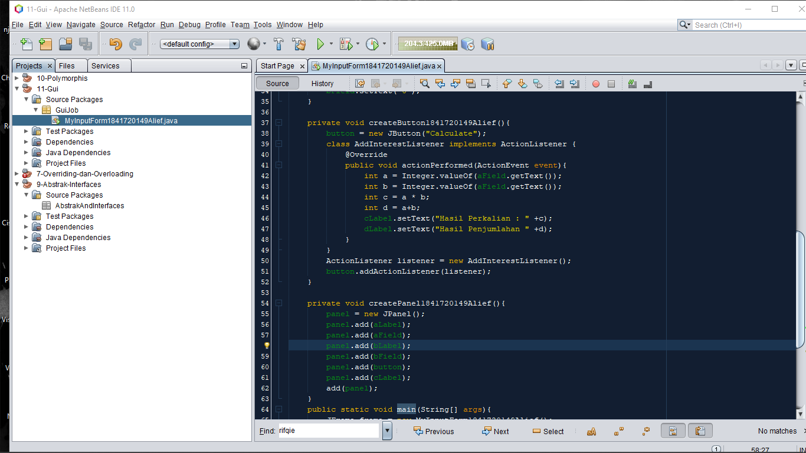
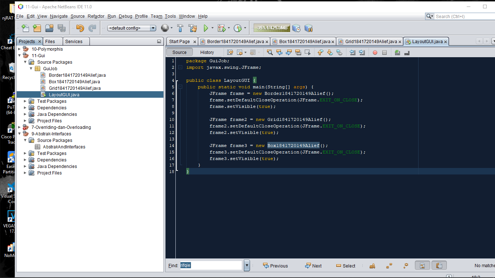
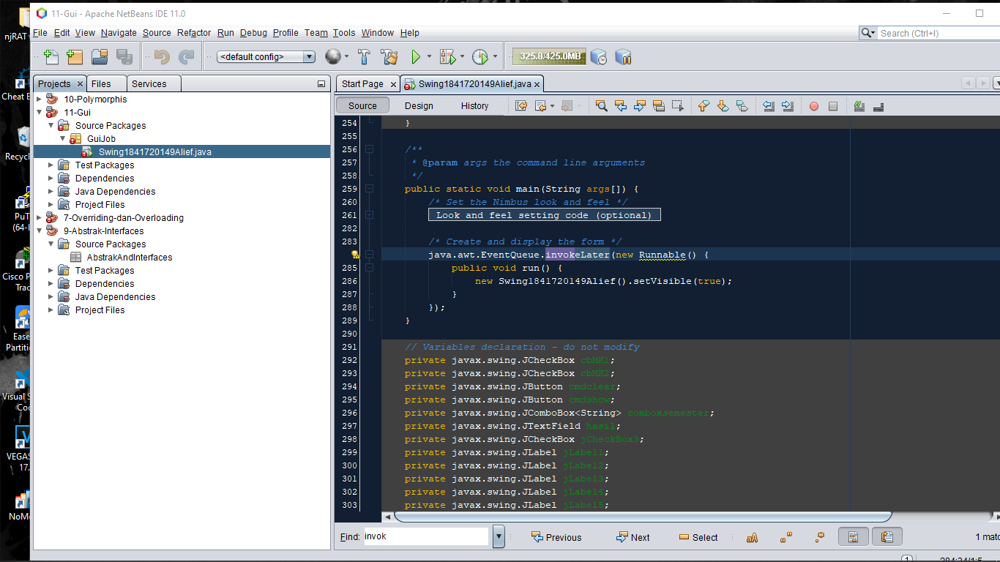
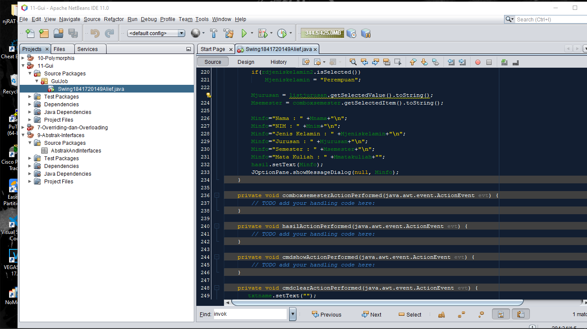
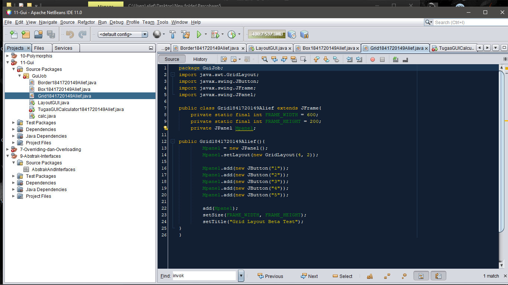
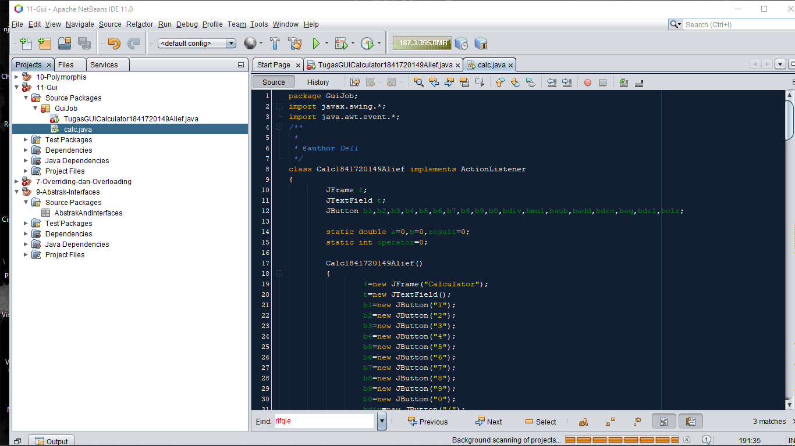

# Laporan Praktikum #11 - GUI (Graphical User Interface)

## Kompetensi
Setelah menyelesaikan lembar kerja ini mahasiswa diharapkan mampu:
1. Membuat aplikasi Graphical User Interface sederhana dengan bahasa pemrograman java;
2. Mengenal komponen GUI seperti frame, label, textfield, combobox, radiobutton, checkbox,
textarea, menu, serta table;
3. Menambahkan event handling pada aplikasi GUI.

## Ringkasan Materi

>Setiap interface pada suatu program memiliki tampilan yang membosankan kepada penggguna. Maka dari itu, muncullah komponen-komponen pada setiap software yang bernama GUI, sehingga interaksi antara komputer dengan manusia semakin bisa mengenal bagaimana prosedur dari perangkat lunak tersebut.

## Percobaan

### Praktikum Percobaan 2
>a) Modifikasi kode program dengan menambahkan JButton baru untuk melakukan fungsi perhitungan penambahan, sehingga ketika button di klik (event click) maka akan menampilkan hasil penambahan dari nilai A dan B

Jawaban :

### Untuk Kode Programnya
[MyInputform.java](../../src/11_GUI/Percobaan2/MyInputForm1841720149Alief.java)

### Praktikum Percobaan 3
a)	Apa perbedaan dari Grid Layout, Box Layout dan Border Layout?

Jawaban :

>-Grid Layout = Penempatan komponen dalam bentuk “rectangular grid” dan berdasarkan jumlah baris dan kolom yang diinginkan.

>-Box Layout = Penempatan komponen dalam satu baris atau satu kolom.

>-Border Layout = Penyusun komponen berdasarkan lokasi geografis: NORTH, SOUTH, EAST, WEST, and CENTER.

b)	Apakah fungsi dari masing-masing kode berikut?
    
Jawaban : 

>Untuk menampilkan frame dimana setVisible merupakan bentuk dari Boolean yang merupakan salah satu macam type data dalam java yang digunakan untuk menampilkan pilihan true or false.

### Praktikum Percobaan 4
a)	Apakah fungsi dari kode berikut?
    
Jawaban : 

>Untuk menampilkan JFrame Form

b)	Mengapa pada bagian logika checkbox dan radio button digunakan multiple if ?

Jawaban : 

>Karena untuk melakukan pengecekan checkbox apakah sudah di checklist atau belum.

c)	Lakukan modifikasi pada program untuk melakukan menambahkan inputan berupa alamat dan berikan fungsi pemeriksaan pada nilai Alamat tersebut jika belum diisi dengan menampilkan pesan peringatan!

Jawaban :

### Praktikum Percobaan 5
a)	Apa kegunaan komponen swing JTabPane, JTtree, pada percobaan 5?

Jawaban :

>JTree = komponen yang digunakan untuk membuat struktur pohon.
JTabbedPane = komponen grafis yang digunakan untuk menyusun dan mengelompokkan berbagai komponen Java lain ke dalam lapisan-lapisan (layers). JTabbedPane termasuk kelas-kelas wadah (container classes) yang terletak di paket javax.swing. 

b)	Modifikasi program untuk menambahkan komponen JTable pada tab Halaman 1 dan tab Halaman 2

Jawaban :

## Tugas

### Code Calculator and Interface

[Main Tugas](../../src/11_GUI/Tugas/calc.java)

[Kode Form](../../src/11_GUI/Tugas/TugasGUICalculator1841720149Alief.form)

[Kode Program](../../src/11_GUI/Tugas/TugasGUICalculator1841720149Alief.java)

## Kesimpulan
>Onscreen (layout) untuk interaksi antara pengguna dengan computer menggunakan tampilan grafis (bukan text). GUI digunakan untuk mengembangkan perangkat lunak karena user-friendly dan menarik, tidak membosankan, dan mudah digunakan.

## Pernyataan Diri

>Saya menyatakan isi tugas, kode program, dan laporan praktikum ini dibuat oleh saya sendiri. Saya tidak melakukan plagiasi, kecurangan, menyalin/menggandakan milik orang lain.
Jika saya melakukan plagiasi, kecurangan, atau melanggar hak kekayaan intelektual, saya siap untuk mendapat sanksi atau hukuman sesuai peraturan perundang-undangan yang berlaku.

Ttd,

***(Alief Al Gaffari)***
