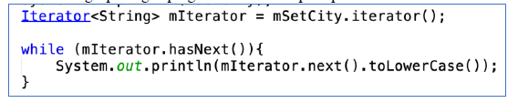
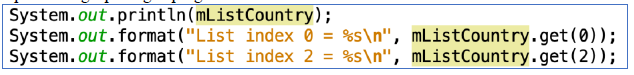
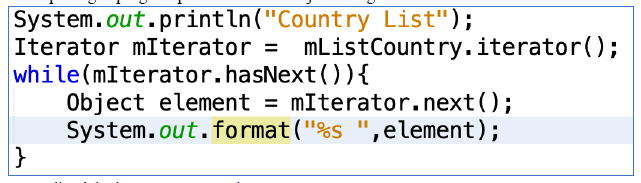
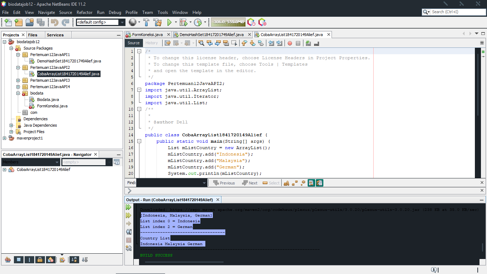
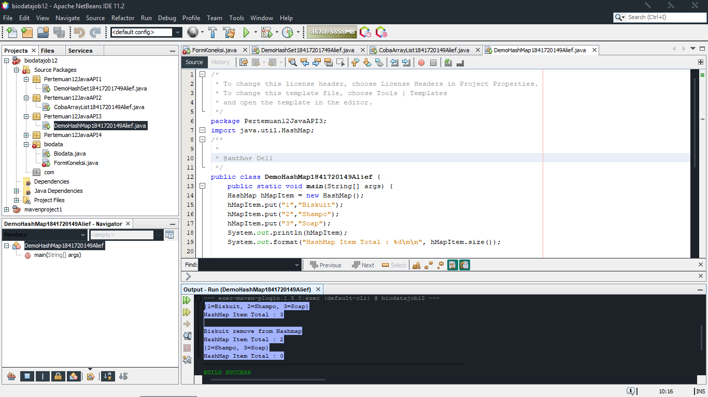
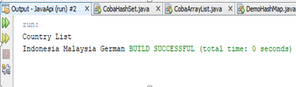

# Laporan Praktikum #12 - Collection (List, Set, Map) dan Database

## Kompetensi

Setelah menempuh pokok bahasan ini, mahasiswa mampu :

•	Memahami cara penyimpanan objek menggunakan Collection dan Map.

•	Mengetahui pengelompokan dari Collection.

•	Mengetahui perbedaan dari interface Set, List dan Map.

•	Mengetahui penggunaan class-class dari interface Set, List, dan Map.

•	Memahami koneksi database menggunakan JDBC dan JDBC API

## Ringkasan Materi

Menyimpan objek menggunakan collection dan map yang didalamnya terdapat interface Set, List, dan Map untuk mengimplementasikannya ke dalam database menggunakan JDBC dan JDBC API. Serta penggunaannya untuk memberi list ke dalam program tersebut untuk ditampilkan ke usernya.

## Percobaan

### Praktikum Percobaan 1
1.	Apakah fungsi import java.util.*; pada program diatas!

    Jawaban :

    Mengambil seluruh object source yang akan dibuat ke dalam program.

2.	Pada baris program keberapakah yang berfungsi untuk menciptakan object HashSet?

    Jawaban :

    Pada baris ke - 3
    
3.	Apakah fungsi potongan program dibawah ini pada percobaan 1!

    
    
    Jawaban :

    Menambahkan data yang akan di proses ke dalam hasil output.

4.	Tambahkan set.add(“Malang”); kemudian jalankan program! Amati hasilnya dan jelaskan mengapa terjadi error!

    Jawaban :

    Karena set.add(“malang”); pada variabel set masih belum di kenal sehingga output masih error.

5.	Jelaskan fungsi potongan program dibawah ini pada percobaan 1!

    

    Jawaban :

    Mengecek Iterator apakah mempunyai elemen selanjutnya atau tidak. Jika benar atau true, maka iterator akan memanggil nilai selanjutnya.

### Praktikum Percobaan 2
1.	Apakah fungsi potongan program dibawah ini!

    

    Jawaban :

    Mengambil deretan data yang mau kita tampilkan  dari sebuah data array.

2.	Ganti potongan program pada soal no 1 menjadi sebagai 
    berikut!
    
    Kemudian jalankan program tersebut!

    Jawaban :
    

3.	Jelaskan perbedaan menampilkan data pada ArrayList menggunakan potongan program pada soal no 1 dan no 2!

    Jawaban :

    Array list pada soal nomor 1 ditampilkan secara vertikal atau atas dan bawah. Sedangkan nomor 2 berurutan secara horizontal atau kiri dan kanan.

### Praktikum Percobaan 3
1.	Jelaskan fungsi hMapItem.put("1","Biskuit") pada program!

    Jawaban :
    Fungsinya untuk memberikan nilai data pada hashMap.
    

2.	Jelaskan fungsi hMapItem.size() pada program!

    Jawaban :
    Untuk menampilkan hasil eksekusi dari data yang sudah di berikan sebelumnya.

3.	Jelaskan fungsi hMapItem.remove("1") pada program!

    Jawaban :
    Untuk menghapus data Map indeks ke 1.

4.	Jelaskan fungsi hMapItem.clear() pada program!

    Jawaban :
    Untuk menghapus semua data yang ada di Map.

5.	Tambahkan kode program yang di blok pada program yang sudah anda buat!

6.	Jalankan program dan amati apa yang terjadi!

    Jawaban :
    
    

7.	Apakah perbedaan program sebelumnya dan setelah ditambahkan kode program pada soal no 5 diatas? Jelaskan!

    Jawaban :

    Pada program sebelumnya dengan program yang baru dia tidak di tampilkan kembali nilai dari indeks dari masing-masingnya. Sedangkan yang baru dia menampilkan nilai dari indeks masing-masingnya secara vertikal.

### Praktikum Percobaan 5
5.Setelah menambah code pada action button klik, coba jalankan program dan tambahkan data. Apakah program berhasil menambahkan data? Jika tidak apakah penyebabnya.

Jawaban :

6.Jelaskan maksud source code untuk melakukan insert data diatas?

Jawaban :

Pertama memanggil method buka_koneksi(), kemudian melakukan insert data pada sql code yang datanya didapat dari inputan melalui fungsi getText(). Kemudian melakukan try catch yang isinya berupa instansiasi PreparedStatement kemudian melakukan executeUpdate lalu close. Jika data berhasil
ditambahkan, maka akan muncul pesan “Data Berhasil Ditambah” melalui JOptionPane.showMessageDialog. Jika gagal, maka akan muncul pesan “Terjadi Kesalahan”

9.Jelaskan alur dari method ambil_data_tabel?

Jawaban :

Pertama memanggil method buka_koneksi() untuk menyambungkan ke database setelah itu executeQuery select ,
taruh pada object dan getString satu” setealh itu di taruh ke dalam model tabel.

10.Buat fungsi untuk merefresh sehingga data yang baru dapat ditampilkan pada tabel. 2.

Jawaban :

## Kesimpulan
Wadah yang menampung value pada kontainer tunggal. Framework java collection menyediakan dengan cara extensible (secara kamus internasional : dapat dibuat panjang atau luas) dan dapat disatukan untuk menangani collections. Pada Groovy, collection dibuat lebih mudah untuk digunakan dan difokuskan menjadi 3 jenis.

## Pernyataan Diri

Saya menyatakan isi tugas, kode program, dan laporan praktikum ini dibuat oleh saya sendiri. Saya tidak melakukan plagiasi, kecurangan, menyalin/menggandakan milik orang lain.

Jika saya melakukan plagiasi, kecurangan, atau melanggar hak kekayaan intelektual, saya siap untuk mendapat sanksi atau hukuman sesuai peraturan perundang-undangan yang berlaku.

Ttd,

***(Alief Al Gaffari)***
