# Laporan Praktikum 14 - GUI dan Database

## Kompetensi

Setelah menempuh materi percobaan ini, mahasiswa mampu mengenal:

1. Menggunakan paradigma berorientasi objek untuk interaksi dengan database.
2. Membuat backend dan frontend.
3. Membuat form sebagai frontend.

## Ringkasan Materi
Membuat database serta tabel-tabelnya, membuat backend yang berisikan objek kode, dan membuat frontend untuk menampilkan interface kepada user dalam varian JDBC, ArrayList, dan Swing.

## Percobaan

### Praktikum Percobaan 1
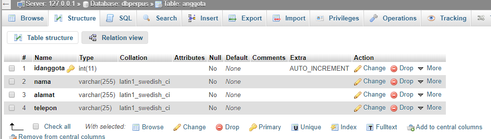
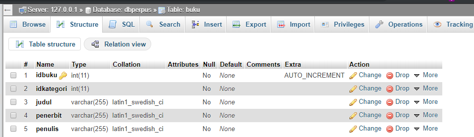
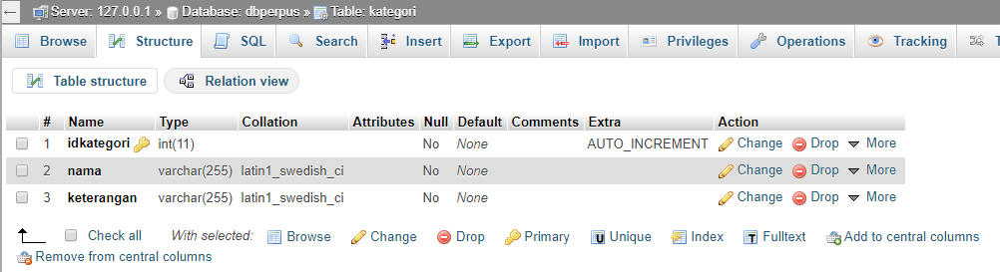
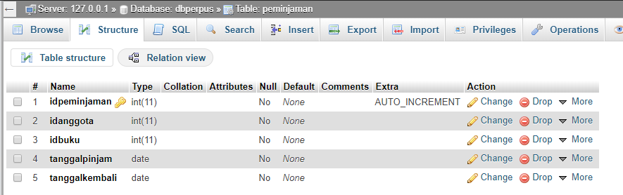

## Praktikum Percobaan 2
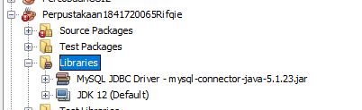

## Praktikum Percobaan 3
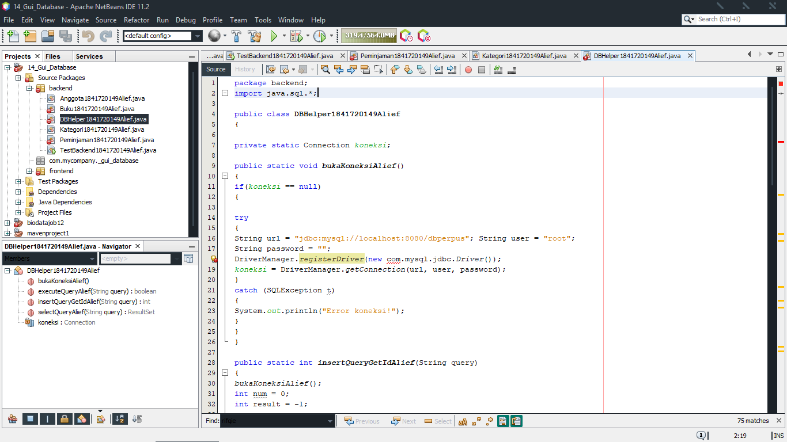
[Link Program](../../src/14_GUI_dan_Database/backend/DBHelper1841720149Alief.java)

## Praktikum Percobaan 4
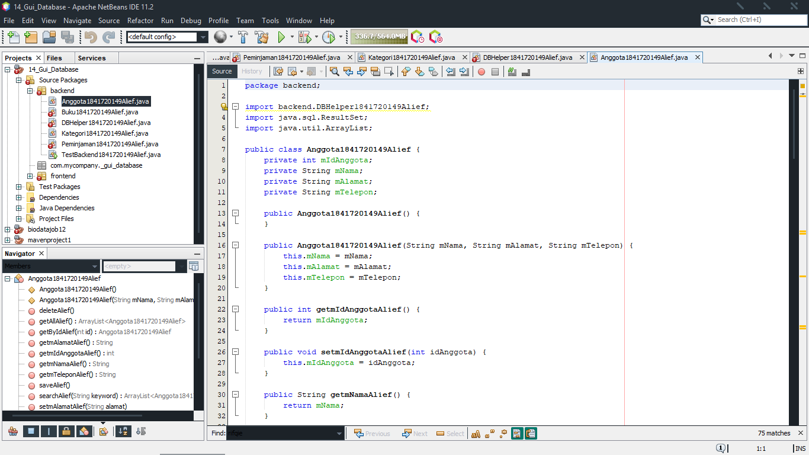
[Link Program](../../src/14_GUI_dan_Database/backend/Anggota1841720149Alief.java)

## Praktikum Percobaan 5
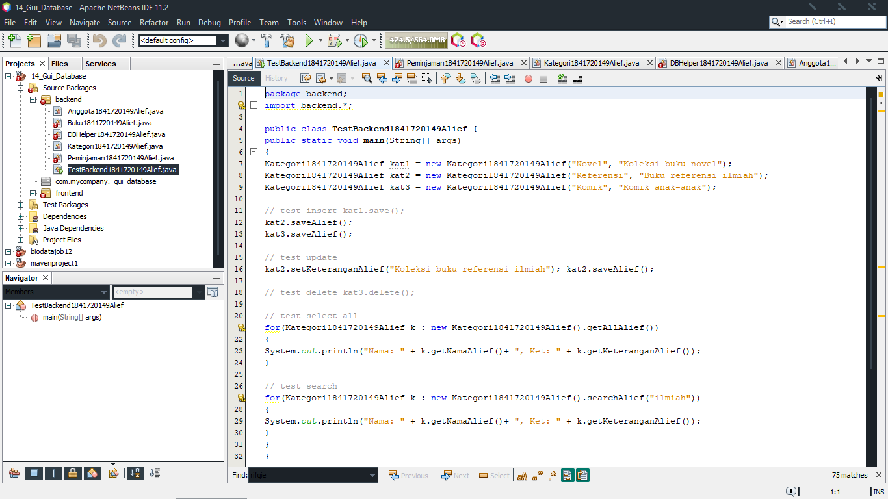
[Link Program](../../src/14_GUI_dan_Database/backend/TestBackend1841720149Alief.java)

## Praktikum Percobaan 6
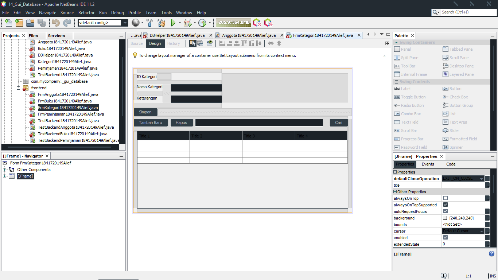
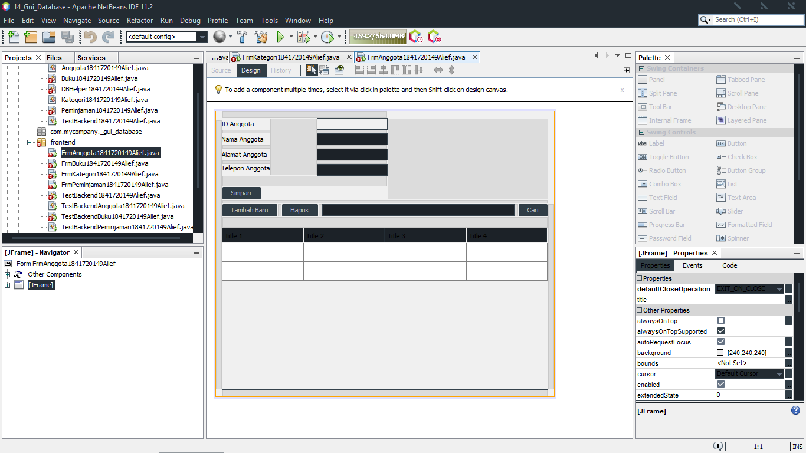
[Link Program](../../src/14_GUI_dan_Database/frontend/FrmAnggota1841720149Alief.java)
[Link Program](../../src/14_GUI_dan_Database/frontend/FrmKategori1841720149Alief.java)

## Praktikum Percobaan 7

[Link Program](../../src/14_GUI_dan_Database/frontend/FrmAnggota1841720149Alief.java)

## Praktikum Percobaan 8
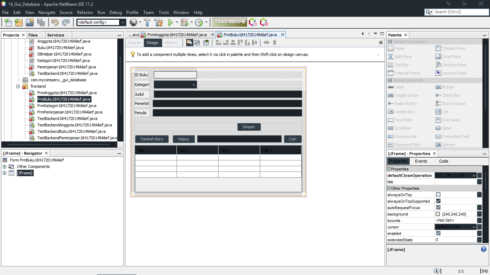
[Link Program](../../src/14_GUI_dan_Database/frontend/FrmBuku1841720149Alief.java)

## Tugas
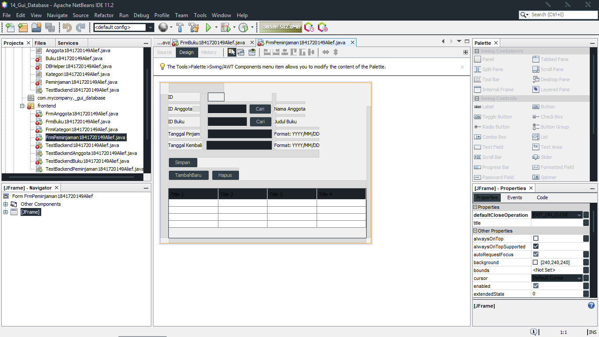
[Link Program](../../src/14_GUI_dan_Database/frontend/FrmPeminjaman1841720149Alief.java)

## Kesimpulan

Mampu menggunakan paradigma database, frontend dan backend dalam suatu form.

## Pernyataan Diri

Saya menyatakan isi tugas, kode program, dan laporan praktikum ini dibuat oleh saya sendiri. Saya tidak melakukan plagiasi, kecurangan, menyalin/menggandakan milik orang lain.

Jika saya melakukan plagiasi, kecurangan, atau melanggar hak kekayaan intelektual, saya siap untuk mendapat sanksi atau hukuman sesuai peraturan perundang-undangan yang berlaku.

Ttd,

***(Alief Al Gaffari)***
