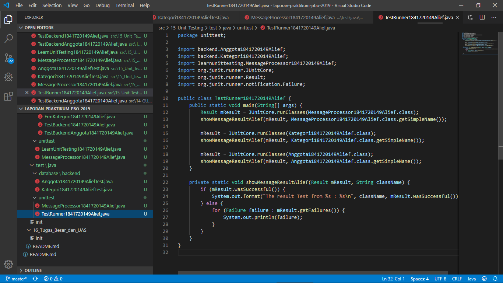

# Laporan Praktikum #15 - Unit Testing

## Kompetensi

Setelah menempuh pokok bahasan ini, mahasiswa mampu :

1.Memahami konsep dan fungsi unit testing

2.Menerapkan unit testing dengan JUnit pada program sederhana

3.Menerapkan unit testing dengan JUnit pada progam yang terkoneksi database

## Ringkasan Materi
Unit testing adalah sebuah kode yang ditulis oleh developer, yang digunakan untuk menguji bagian kecil/area spesifik dari suatu aplikasi yang telah/sedang dibuat. Unit testing bertujuan untuk menghilangkan kebutuhan akan pengujian manual kode aplikasi oleh manusia (tester/QC). Sehingga dengan kata lain unit testing adalah usaha untuk mengotomatiskan pengujian kode program (automated test) Kode tes tidak akan dikirimkan ke user, melainkan hanya production code (kode yang digunakan dalam program utama) saja yang dikirim. Unit testing dilakukan setelah programmer selesai menuliskan suatu kode/fungsi/method yang ada dalam suatu class. Dapat juga dilakukan setelah menambahkan sebuah fungsionalitas baru atau setelah melakukan refactoring.

## Percobaan

### Praktikum Percobaan 1

`Kode Program`

* [MessageProcessor1841720149Alief.java](../../src/15_Unit_Testing/main/java/unittest/MessageProcessor1841720149Alief.java)
* [LearnUnitTesting1841720149Alief.java](../../src/15_Unit_Testing/main/java/unittest/LearnUnitTesting1841720149Alief.java)
* [MessageProcessor1841720149AliefTest.java](../../src/15_Unit_Testing/test/java/unittest/MessageProcessor1841720149Alief.java)
* [TestRunner1841720019Sultan.java](../../src/15_Unit_Testing/test/java/unittest/TestRunner1841720149Alief.java)

### Praktikum Percobaan 2

* [Kategori1841720149Alief.java](../../src/15_Unit_Testing/main/java/database/backend/Kategori1841720149Alief.java)
* [DBHelper1841720149Alief.java](../../src/15_Unit_Testing/main/java/database/backend/DBHelper1841720149Alief.java)
* [TestBackend1841720149Alief.java](../../src/15_Unit_Testing/main/java/database/frontend/TestBackend1841720149Alief.java)
* [FrmKategori1841720149Alief.java](../../src/15_Unit_Testing/main/java/database/frontend/FrmKategori1841720149Alief.java)
* [FrmKategori1841720149Alief.form](../../src/15_Unit_Testing/main/java/database/frontend/FrmAnggota1841720149Alief.form)
* [Kategori1841720149Alief.java](../../src/15_Unit_Testing/test/java/../../main/java/database/backend/Kategori1841720149Alief.java)
* [TestRunner1841720149Alief.java](../../src/15_Unit_Testing/test/java/unittest/TestRunner1841720149Alief.java)

## Tugas

* [Anggota1841720149Alief.java](../../src/15_Unit_Testing/main/java/database/backend/Anggota1841720149Alief.java)
* [DBHelper1841720149Alief.java](../../src/15_Unit_Testing/main/java/database/backend/DBHelper1841720149Alief.java)
* [TestBackendAnggota1841720149Alief.java](../../src/15_Unit_Testing/main/java/id/natlus/jobsheet15/database/frontend/TestBackendAnggota1841720149Alief.java)
* [FrmAnggota1841720149Alief.java](../../src/15_Unit_Testing/main/java/id/natlus/jobsheet15/database/frontend/FrmAnggota1841720149Alief.java)
* [FrmAnggota1841720149Alief.form](../../src/15_Unit_Testing/main/java/id/natlus/jobsheet15/database/frontend/FrmAnggota1841720149Alief.form)
* [Anggota1841720149AliefTest.java](../../src/15_Unit_Testing/test/java/id/natlus/jobsheet15/database/backend/Anggota1841720149AliefTest.java)
* [TestRunner1841720149Alief.java](../../src/15_Unit_Testing/test/java/id/natlus/jobsheet15/unittest/TestRunner1841720149Alief.java)

## Kesimpulan

1. Saya mampu memahami konsep dan fungsi unit testing

2. Saya mampu menerapkan unit testing dengan JUnit pada program sederhana.

3. Saya mampu menerapkan unit testing dengan JUnit pada progam yang terkoneksi database

## Pernyataan Diri

Saya menyatakan isi tugas, kode program, dan laporan praktikum ini dibuat oleh saya sendiri. Saya tidak melakukan plagiasi, kecurangan, menyalin/menggandakan milik orang lain.

Jika saya melakukan plagiasi, kecurangan, atau melanggar hak kekayaan intelektual, saya siap untuk mendapat sanksi atau hukuman sesuai peraturan perundang-undangan yang berlaku.

Ttd,

***(Alief Al Gaffari)***
