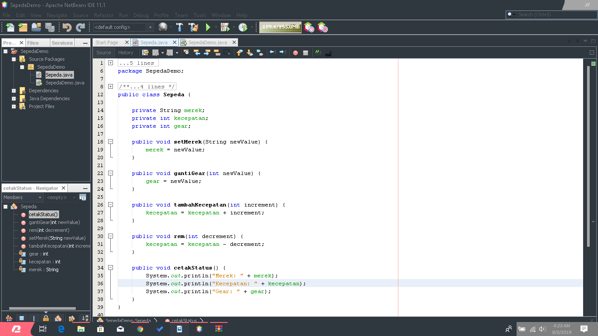

# Laporan Praktikum #1 - Pengantar Konsep PBO

## Kompetensi

1. Perbedaan paradigma berorientasi objek dengan paradigma struktural
2. Konsep dasar PBO

## Ringkasan Materi

mengetahui bahwa kode extend itu untuk mengkoneksikan dari class pertama dengan class kedua agar terhubung

## Percobaan

### Percobaan 1

Link kode program : [ini contoh link ke kode program](../../src/1_Pengantar_Konsep_PBO/Contoh12345Habibie.java)

https://github.com/arcparagon/PBOpraktikum/src/1_Pengantar_Konsep_PBO/Percobaan1 no1.java
https://github.com/arcparagon/PBOpraktikum/src/1_Pengantar_Konsep_PBO/Percobaan1 no2.java

### Percobaan 2

https://github.com/arcparagon/PBOpraktikum/docs/1_Pengantar_Konsep_PBO/img/Percobaan2 Hasil.png

https://github.com/arcparagon/PBOpraktikum/src/1_Pengantar_Konsep_PBO/Percobaan2 no1.java
https://github.com/arcparagon/PBOpraktikum/src/1_Pengantar_Konsep_PBO/Percobaan2 no2.java

## Pertanyaan
1.Kelas — kumpulan atas definisi data dan fungsi-fungsi dalam suatu unit untuk suatu tujuan tertentu.
  Objek - membungkus data dan fungsi bersama menjadi suatu unit dalam sebuah program komputer; objek merupakan dasar dari modularitas dan struktur dalam sebuah program komputer berorientasi objek.
  Abstraksi - Kemampuan sebuah program untuk melewati aspek informasi yang diproses olehnya
  Enkapsulasi - Memastikan pengguna sebuah objek tidak dapat mengganti keadaan dalam dari sebuah objek dengan cara yang tidak layak
  Polimorfisme melalui pengiriman pesan. Tidak bergantung kepada pemanggilan subrutin
2.Class merupakan kumpulan dari suatu fungsi-fungsi yang dibuat untuk suatu tujuan tertentu
  Sedangkan Object adalah pemanfaatan dari class yang siap untuk digunakan.
3. Meningkatkan Produktivitas
   Kecepatan Pengembangan
   Kemudahan Pemeliharaan
   Adanaya Konstitensi
   Meningkatkan Kualitas Perangkat Lunak
4.-setMerek
  -gantiGear
  -tambahKecepatan
  -rem
  -cetakStatus
5.private String merek, colour; **disini kita tambah string colour**
    private int kecepatan;
    private int gear;

    public void setMerek(String newValue) {
        merek = newValue;
    }
    
    public void setColour(String newValue) { **dan disini untuk menambah colour**
        colour = newValue;
    }
 6.SepedaGunung pada dasarnya adalah sama dengan Sepeda (memiliki gear,
memiliki kecepatan, dapat menambah kecepatan, dapat mengerem, pindah gigi, dsb) namun ada
fitur tambahan yaitu tipe suspensi. Maka kita tidak perlu membuat class SepedaGunung dari nol, kita extend atau wariskan saja dari class pertama

tugas 6
D:\Semester 2\Program Berbasis Object\PraktikumBerbasisObject\PraktikumPBO\docs\1_Pengantar_Konsep_PBO\tugas

## Tugas

PBOpraktikum/src/1_Pengantar_Konsep_PBO/Weapons.java
PBOpraktikum/src/1_Pengantar_Konsep_PBO/WeaponsDemo.java
PBOpraktikum/src/1_Pengantar_Konsep_PBO/WeaponsVip.java

## Kesimpulan

ketika memakai extend dari class pertama maka tidak perlu membuat class baru dari nol lagi

## Pernyataan Diri

Saya menyatakan isi tugas, kode program, dan laporan praktikum ini dibuat oleh saya sendiri. Saya tidak melakukan plagiasi, kecurangan, menyalin/menggandakan milik orang lain.

Jika saya melakukan plagiasi, kecurangan, atau melanggar hak kekayaan intelektual, saya siap untuk mendapat sanksi atau hukuman sesuai peraturan perundang-undangan yang berlaku.

Ttd,

ALIEF AL GAFFARI