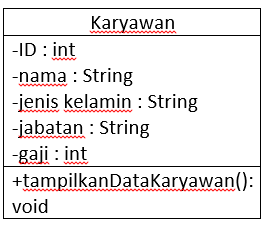
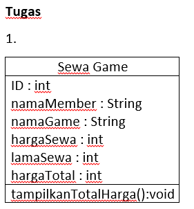

# Laporan Praktikum #2 - Class dan Object

## Kompetensi

Memahami deskripsi dari class dan object serta bagaimana cara mengimplementasikannya.

## Ringkasan Materi

Class dan Object merupakan gabungan dari suatu program. Ibaratnya class itu seperti judul dan Object itu bisa dijadikan berbagai macam seperti isi, inti dari pemrograman, dan juga proses bagaimana kode pemrograman tersebut disusun.

## Percobaan

### Percobaan 1

1. Screenshot:

2.Karyawan.

3.ID, Nama, Jenis Kelamin, Jabatan, dan Gaji.

4.tampilkanDataKaryawan.

### Percobaan 2

3.[link ke kode program](../../src/2_Class_dan_Object/Percobaan2/Mahasiswa1841720149Alief.java)

5.[link ke kode main program](../../src/2_Class_dan_Object/Percobaan2/MainMahasiswa1841720149Alief.java)

6. Screenshot:

7.Pendeklarasian atributnya akan dilakukan di void tampilBiodata.

8.Pendeklarasian methodnya akan dilakukan di main file pada java.

9.Ada 4

10.Menginput bahwa NIM (Nomor Induk Mahasiswa) pada mahasiswa tersebut adalah 101.

11.Menampilkan semua data yang telah dimasukkan ke dalam suatu atribut untuk dijalankan.

12. Screenshot:

## Percobaan 3

3.[link ke kode program](../../src/2_Class_dan_Object/Percobaan3/Barang1841720149AliefAG.java)

5.[link ke kode main program](../../src/2_Class_dan_Object/Percobaan3/TestBarang1841720149Alief.java)

6. Screenshot:

7. Menambahkan suatu method yang didalamnya terkandung atribut.

8. Return yaitu mengembalikan suatu proses yang dimana ketika kita menjalankan suatu program, method yang ditambahkan ke dalam suatu atribut akan dikembalikan lagi dengan hasil yang baru atau tetap. Method harus memiliki return ketika ada perubahan atau perulangan.

## Tugas

1. Screenshot:

2. Screenshot:

[link ke kode program](../../src/2_Class_dan_Object/Tugas1/SewaGame1841720149Alief.java)
[link ke kode main program](../../src/2_Class_dan_Object/Tugas1/SewaGameMain1841720149Alief.java)

3. Screenshot:

[link ke kode program](../../src/2_Class_dan_Object/Tugas2/Lingkaran1841720149Alief.java)
[link ke kode main program](../../src/2_Class_dan_Object/Tugas2/LingkaranMain184

4. Screenshot:

[link ke kode program](../../src/2_Class_dan_Object/Tugas3/DiscountPackage1841720149Alief.java)
[link ke kode main program](../../src/2_Class_dan_Object/Tugas3/DiscountPackageMain1841720149Alief.java)

## Kesimpulan

Class dan Object memiliki atribut dan method sesuai dengan apa yang diinginkan oleh programmernya dan memiliki aturan tertentu.

## Pernyataan Diri

Saya menyatakan isi tugas, kode program, dan laporan praktikum ini dibuat oleh saya sendiri. Saya tidak melakukan plagiasi, kecurangan, menyalin/menggandakan milik orang lain.

Jika saya melakukan plagiasi, kecurangan, atau melanggar hak kekayaan intelektual, saya siap untuk mendapat sanksi atau hukuman sesuai peraturan perundang-undangan yang berlaku.

Ttd,

***(Alief Al Gaffari)***