# Laporan Praktikum #3 - Enkapsulasi Pada Pemrograman Berorientasi Objek
***Copyright Alief Al Gaffari***
## Kompetensi

Setelah melakukan percobaan pada modul ini, mahasiswa memahami konsep:
1. Konstruktor
2. Akses Modifier
3. Atribut/method pada class
4. Intansiasi atribut/method
5. Setter dan getter
6. Memahami notasi pada UML Class Diagram

## Ringkasan Materi

> Pada modul pertama telah dijabarkan definisi dari enkapsulasi sebagai berikut:
Enkapsukasi disebut juga dengan information-hiding. Dalam berinteraksi dengan objek, seringkali kita tidak perlu mengetahui kompleksitas yang ada didalamnya. Hal ini akan lebih mudah dipahami jika kita membayangkan atau menganalisa objek yang ada disekitar kita, misalnya objek sepeda, ketika kita mengganti gear pada sepeda, kita tinggal menekan tuas gear yang ada di grip setang sepeda saja. Kita tidak perlu mengetahui bagaimana cara gear berpindah secara teknis. Contoh objek lain misalnya mesin penghisap debu (vacum cleaner), ketika kita mencolokkan kabel vacum cleaner dan menyalakan sakelarnya maka mesin tersebut siap digunakan untuk menghisap debu. Dalam proses tersebut kita tidak mengetahui proses rumit yang terjadi ketika mengubah listrik menjadi tenaga dari vacum cleaner. Dalam contoh diatas vacum cleaner dan sepeda telah menerapkan enkapsulasi atau disebut juga information-hiding atau data hiding karena menyembunyikan detail proses suatu objek dari pengguna.

## Percobaan

### Percobaan 1 - Enkapsulasi

Didalam percobaan 1 ini menggunakan konsep enkapsulasi. Buatlah class Motor yang memiliki atribut kecepatan dan kontakOn, dan memiliki method printStatus(); untuk menampilkan status motor dan ditampilkan pada class MotorDemo (main).

Hasilnya adalah sebagai berikut:

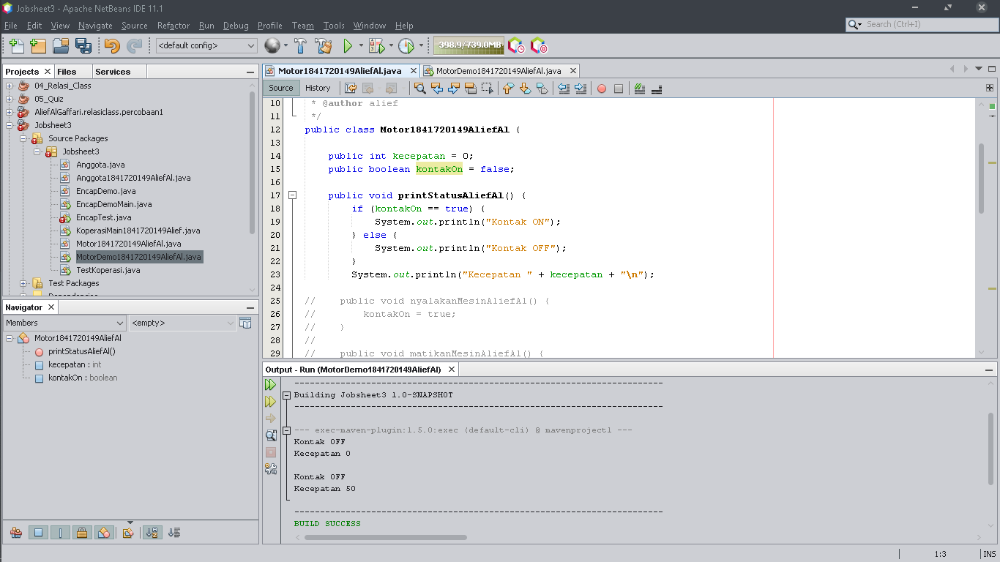
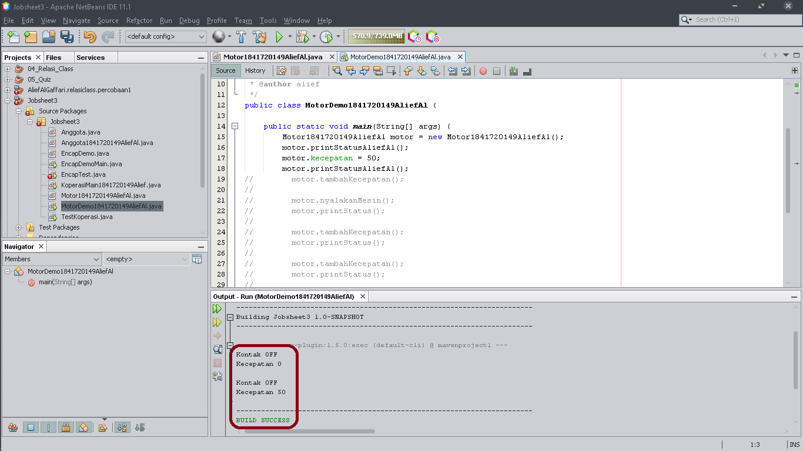

### Percobaan 2 - Access Modifier

Pada percobaan ini akan digunakan access modifier untuk memperbaiki cara kerja class Motor pada percobaan ke-1.

Implementasi class Motor adalah sebagai berikut:

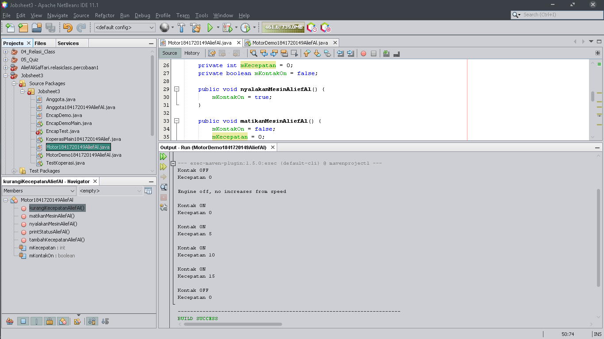
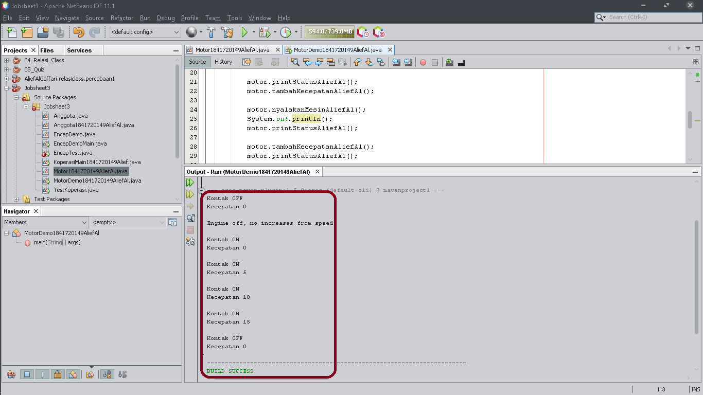

Link ke kode program:

[Motor1841720149AliefAl](../../src/3_Enkapsulasi/Motor1841720149AliefAl.java)

[MotorDemo1841720149AliefAl](../../src/3_Enkapsulasi/MotorDemo1841720149AliefAl.java)

### Pertanyaan - Percobaan 2

1. Pada class TestMobil, saat kita menambah kecepatan untuk pertama kalinya, mengapa muncul peringatan “Kecepatan tidak bisa bertambah karena Mesin Off!”?
2. Mengapat atribut kecepatan dan kontakOn diset private?
3. Ubah class Motor sehingga kecepatan maksimalnya adalah 100!

**Jawab:**

1. Karena awal mula dari program (Motor) tersebut masih dalam keadaan mati(off), maka perlunya kita memanggil method motor.nyalakanMesin() pada class MotorDemo. Agar bisa menambah kecepatan pada saat kita menambahkan method tambahKecepatan() pada class MotorDemo.

2. Untuk meningkatkan keamanan data;
> * Agar lebih mudah dalam mengontrol atribut dan method;
> * Class bisa kita buat menjadi read-only dan write-only;
> * dan fleksibel: programmer dapat mengganti sebagian dari kode tanpa harus takut berdampak pada kode yang lain.
* Sumber : https://www.petanikode.com/java-oop-setter-getter/

3. Hasil output setelah mengubah sehingga kecepatan maksimalnya hanya 100:

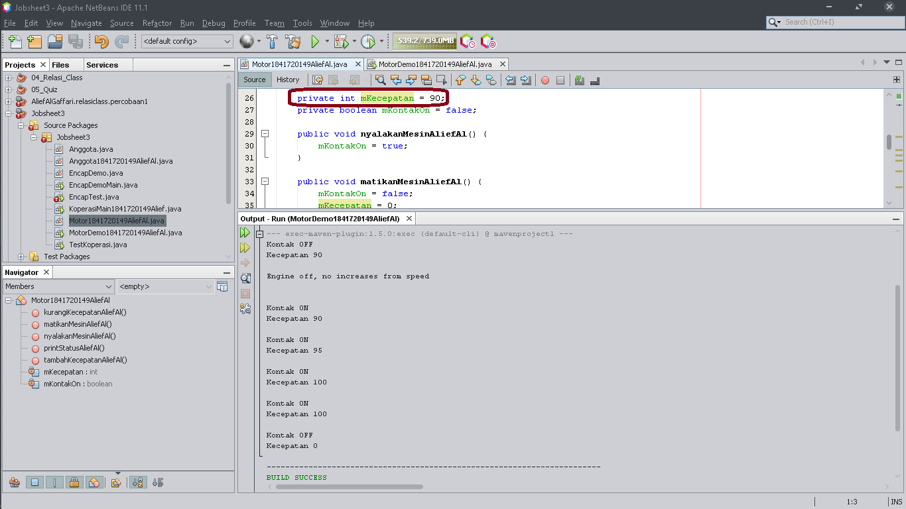
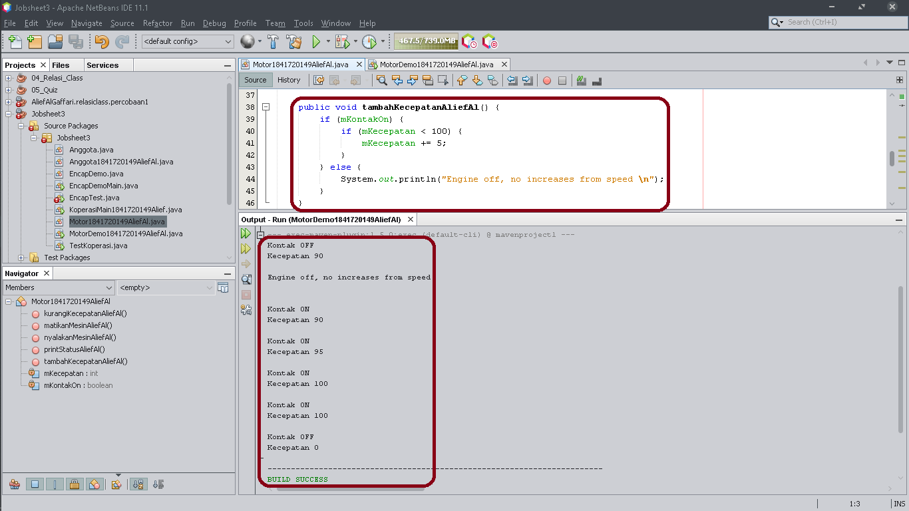

## Percobaan 3 - Getter dan Setter

Menulis method yang memiliki argument/parameter dan memiliki return

class Anggota dibawah ini:

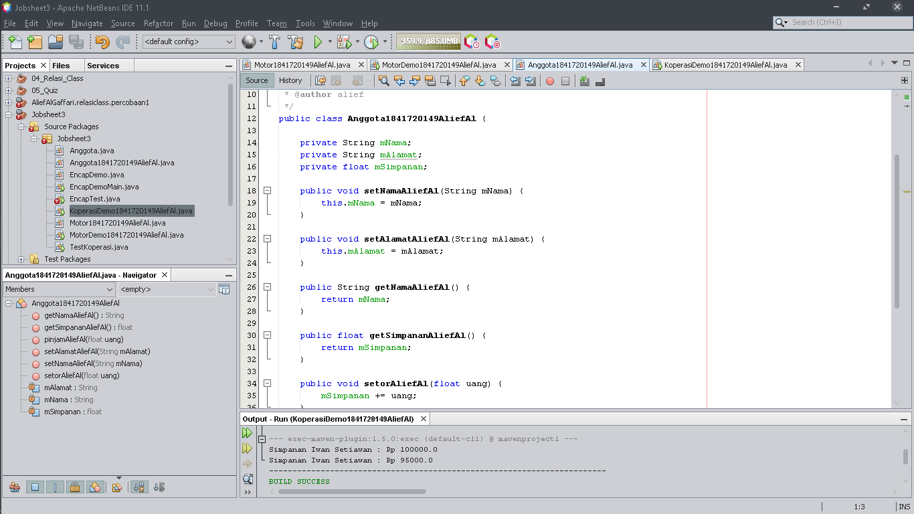

class KoperasiDemo untuk mencoba class Anggota. Hasil dari main method:

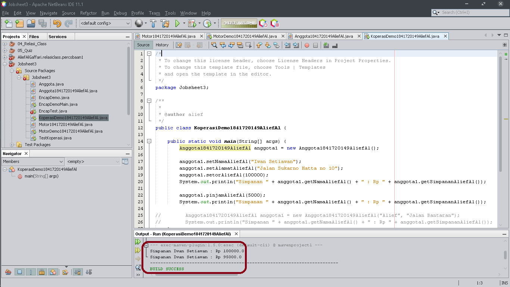

## Percobaan 4 - Konstruktor, Instansiasi

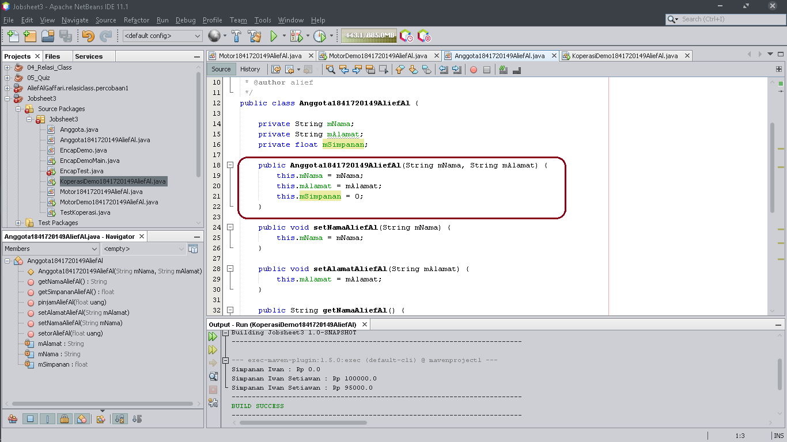
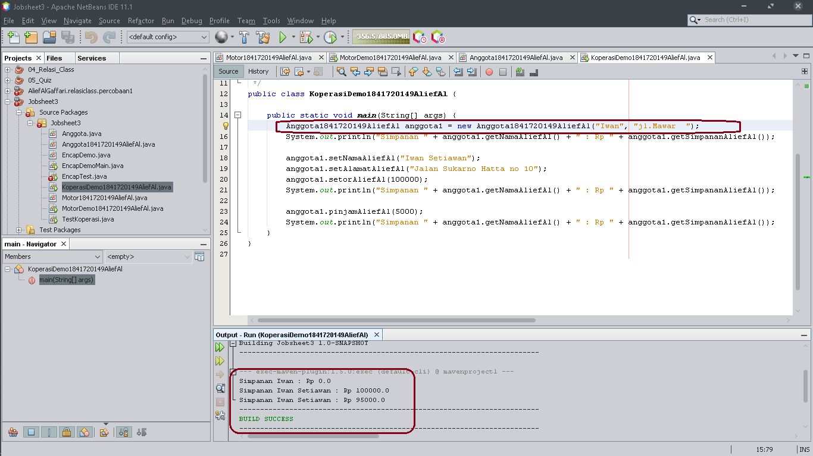

Link ke kode program:

[Anggota1841720149AliefAl](../../src/3_Enkapsulasi/Anggota1841720149AliefAl.java)

[KoperasiDemo1841720149AliefAl](../../src/3_Enkapsulasi/KoperasiDemo1841720149AliefAl.java)

### Pertanyaan – Percobaan 3 dan 4

1. Apa yang dimaksud getter dan setter?
2. Apa kegunaan dari method getSimpanan()?
3. Method apa yang digunakan untk menambah saldo?
4. Apa yand dimaksud konstruktor?
5. Sebutkan aturan dalam membuat konstruktor?
6. Apakah boleh konstruktor bertipe private?
7. Kapan menggunakan parameter dengan passsing parameter?
8. Apa perbedaan atribut class dan instansiasi atribut?
9. Apa perbedaan class method dan instansiasi method?

**Jawab:**

1. **Getter** adalah public method dan memiliki tipe data return, yang berfungsi untuk mendapatkan nilai dari atribut private. Sedangkan **Setter** adalah public method yang tidak memliki tipe data return, yang berfungsi untuk memanipulasi nilai dari atribut private.

2. Kegunaan dari method **getSimpanan()** untuk menyimpan transaksi setor() dan pinjam/tarik() data transaksi berapa uang yang disetorkan ataupun dipinjam.

3. **setorAliefAl()**

4. **Konstruktor** mirip dengan method cara deklarasinya akan tetapi tidak memiliki tipe return. Dan konstruktor dieksekusi ketika instan dari objek dibuat. Jadi setiap kali sebuat objek dibuat dengan keyword new() maka konstruktor akan dieksekusi.

5. **konstruktor** dieksekusi ketika instan dari objek dibuat.

6. tidak boleh karena tidak dapat di panggil oleh class lain.

7. Jika kita menggunakan konstruktor pada class maka sebaiknya kita menggunakan passing parameter pada class mainnya, begitu juga sebaliknya.

8. Attribute dari sebuah class adalah variabel global yang dimiliki sebuah class, sedangkan instansiasi atribut adalah atribut yang didefinisikan di dalam suatu metode dan hanya menjadi milik dari instance class itu sendiri.

9. Class method adalah method yang terikat dengan kelas lain dan itu bukan objek class. Sedangkan instansiasi method adalah metode pembuatan objek, lalu dikenalkan dengan kelas lain, dan mengenalkannya dengan objek class-nya.

## Tugas

1. Screenshot:

Link ke kode program:

[EncapDemo1841720149AliefAl](../../src/3_Enkapsulasi/EncapDemo1841720149AliefAl.java)

[EncapTest1841720149AliefAl](../../src/3_Enkapsulasi/EncapTest1841720149AliefAl.java)

2. Pada program diatas, pada class EncapTest kita mengeset age dengan nilai 35, namun pada saat ditampilkan ke layar nilainya 30, jelaskan mengapa ?

**Jawab**

Karena di class EncapDemo dalam method setAge, if(newAge > 30) umur tidak bisa melebihi angka 30, Nilai 30 adalah angka maksimal. Dan jika memasukkan nilai kurang dari 30 maka hasilnya akan muncul.

3. Screenshot:
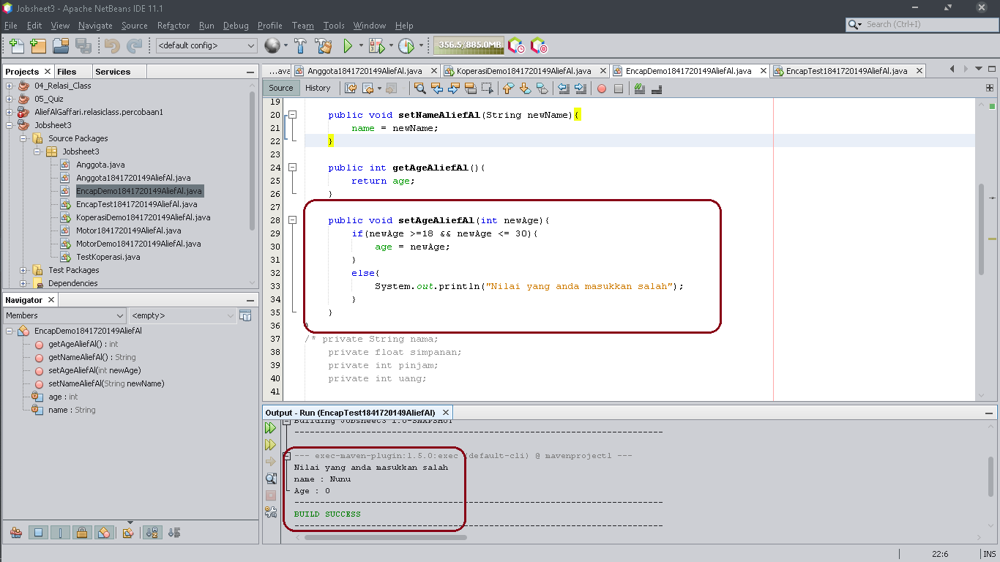

[EncapTest1841720149AliefAl](../../src/3_Enkapsulasi/EncapTest1841720149AliefAl.java)

4. Screenshot:

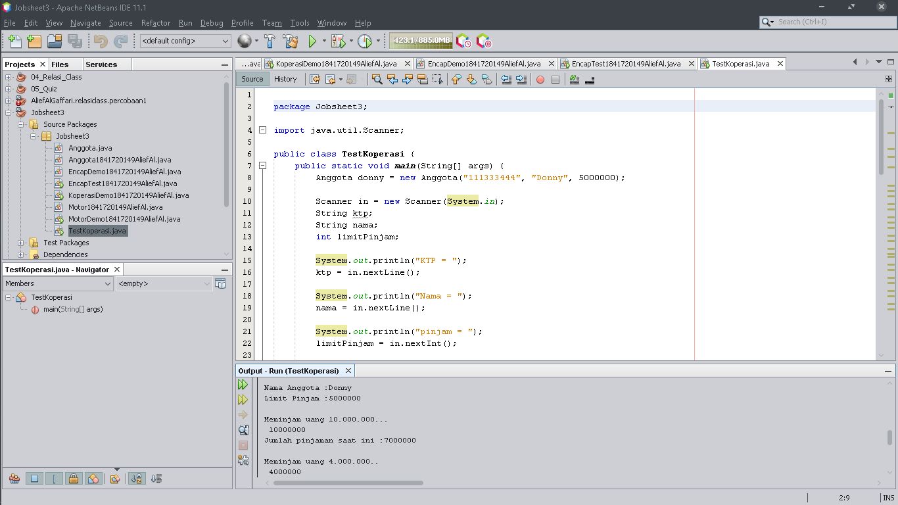

[TestKoperasi](../../src/3_Enkapsulasi/TestKoperasi.java)

5. Modifikasi Soal no 4
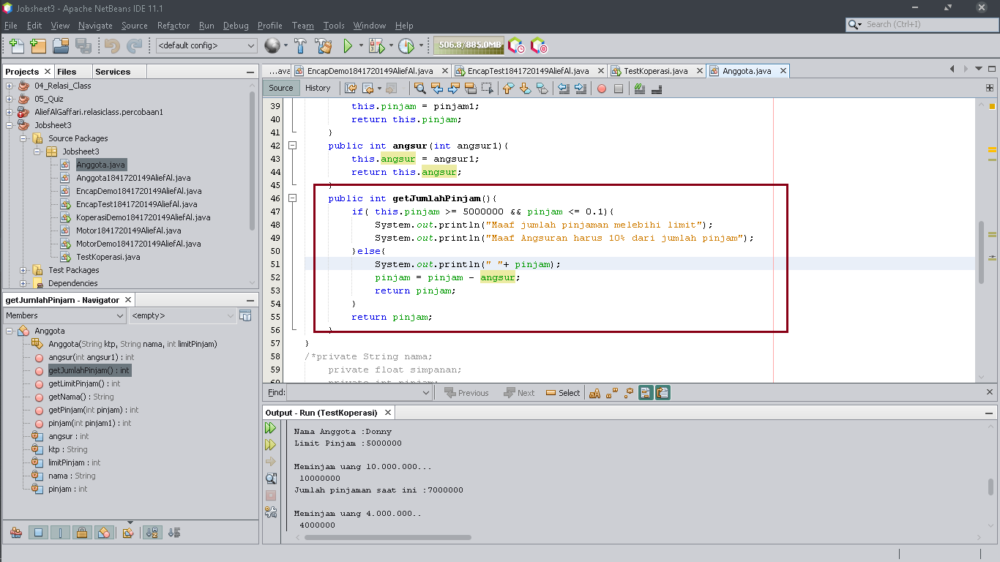

[TestKoperasi](../../src/3_Enkapsulasi/TestKoperasi.java)

6. Modiikasi Class test koperasi

## Kesimpulan

> Dari percobaan diatas, telah dipelajari kosep dari enkapsulasi, kontruktor, access modifier yang terdiri dari 4 jenis yaitu public, protected, default dan private. Konsep atribut atau method class yang ada di dalam blok code class dan konsep instansiasi atribut atau method. Cara penggunaan getter dan setter beserta fungsi dari getter dan setter. Dan juga telah dipelajari atau memahami notasi UML

## Pernyataan Diri

Saya menyatakan isi tugas, kode program, dan laporan praktikum ini dibuat oleh saya sendiri. Saya tidak melakukan plagiasi, kecurangan, menyalin/menggandakan milik orang lain.

Jika saya melakukan plagiasi, kecurangan, atau melanggar hak kekayaan intelektual, saya siap untuk mendapat sanksi atau hukuman sesuai peraturan perundang-undangan yang berlaku.

Ttd,

***(Alief Al Gaffari)***