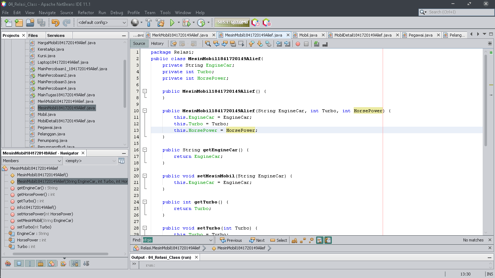
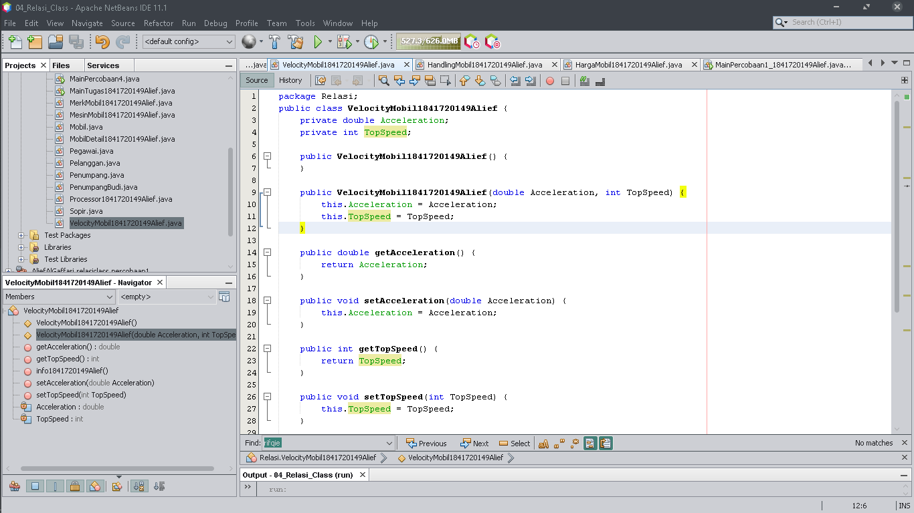

# Laporan Praktikum #4 - Relasi Kelas

## Kompetensi

Setelah menempuh pokok bahasan ini, mahasiswa mampu:
1. Memahami konsep relasi kelas.
2. Mengimplementasikan relasi has‑a dalam program.

## Ringkasan Materi

Merealisasikan bagaimana merelasikan 2 class atau 2 judul pada kode program (atau disebut has-a). Relasi ini bisa direlasikan lewat UML yang dimana perlu mendalami jenis relasi lainnya.

## Percobaan

### Pertanyaan Percobaan 1
1. Di dalam class Processor dan class Laptop , terdapat method setter dan getter untuk masing masing atributnya. Apakah gunanya method setter dan getter tersebut ?

    Jawaban : Getter yaitu mengambil data, sedangkan Setter yaitu mengatur data.
  
2. Di dalam class Processor dan class Laptop, masing masing terdapat konstruktor default dan konstruktor berparameter. Bagaimanakah beda penggunaan dari kedua jenis konstruktor tersebut ?

    Jawaban : Memisahkan konstruktor default dan berparameter, fungsinya sebagai sumber yang dimana ketika kita membuat suatu objek baru, konstruktor tersebut dapat mengenalinya.
 
3. Perhatikan class Laptop, di antara 2 atribut yang dimiliki (merk dan proc), atribut manakah yang bertipe object ?
Jawaban : Proc.
 
4. Perhatikan class Laptop, pada baris manakah yang menunjukan bahwa class Laptop memiliki relasi dengan class Processor ? 

    Jawaban : 3, 8, 10, 22, 26, dan 31.

5. Perhatikan pada class Laptop , Apakah guna dari sintaks proc.info() ?

    Jawaban : Menampilkan informasi dari Processor pada Laptop tersebut.
 
6. Pada class MainPercobaan1, terdapat baris kode: 
Laptop l = new Laptop("Thinkpad", p);. 
Apakah p tersebut ? 
Dan apakah yang terjadi jika baris kode tersebut diubah menjadi: 
Laptop l = new Laptop("Thinkpad", new Processor("Intel i5", 3)); 
Bagaimanakah hasil program saat dijalankan, apakah ada perubahan ?

    Jawaban : 
    
    P adalah objek dari processor. Iya, variabel new yang lama tidak ditampilkan, alhasil variable new yang baru lah yang hanya dapat ditampilkan.

### Pertanyaan Percobaan 2
1. Perhatikan class Pelanggan. Pada baris program manakah yang menunjukan bahwa class Pelanggan memiliki relasi dengan class Mobil dan class Sopir ? 
Jawaban : 19, 23, 27, 31, dan 43.

2. Perhatikan method hitungBiayaSopir pada class Sopir, serta method hitungBiayaMobil pada class Mobil. Mengapa menurut Anda method tersebut harus memiliki argument hari ? 

    Jawaban : Karena ketika menghitung total biaya pada class Mobil dan Sopir, objek hari itu sebagai patokan dari berapa waktu yang diperlukan.

3. Perhatikan kode dari class Pelanggan. Untuk apakah perintah mobil.hitungBiayaMobil(hari) dan sopir.hitungBiayaSopir(hari) ? 

    Jawaban : Untuk menghitung berapa biaya totalnya.

4. Perhatikan class MainPercobaan2. Untuk apakah sintaks p.setMobil(m) dan p.setSopir(s) ? 

    Jawaban : Untuk menginisialisasi main objek dari Mobil dan Sopir itu.

5. Perhatikan class MainPercobaan2. Untuk apakah proses p.hitungBiayaTotal() tersebut ?

    Jawaban : Untuk menampilkan berapa seluruh biaya totalnya.
 
6. Perhatikan class MainPercobaan2, coba tambahkan pada baris terakhir dari method main dan amati perubahan saat di run! 
System.out.println(p.getMobil().getMerk()); 
Jadi untuk apakah sintaks p.getMobil().getMerk() yang ada di dalam method main tersebut?

    Jawaban :
    
    Menampilkan merk mobil pada main class tersebut.
    

### Pertanyaan Percobaan 3
1. Di dalam method info() pada class KeretaApi, baris this.masinis.info() dan this.asisten.info() digunakan untuk apa ? 

    Jawaban : Menampilkan siapa nama Asisten dan Masinis nya.

2. Buatlah main program baru dengan nama class MainPertanyaan pada package yang sama. Tambahkan kode berikut pada method main() ! 
Pegawai masinis = new Pegawai("1234", "Spongebob Squarepants"); 
KeretaApi keretaApi = new KeretaApi("Gaya Baru", "Bisnis", masinis); 
System.out.println(keretaApi.info());

    Jawaban :  

    Ini adalah kode main programnya : [link main kode program](../../src/4_Relasi_Class/MainPercobaan3.java)

3. Apa hasil output dari main program tersebut? Mengapa hal tersebut dapat terjadi?

    Jawaban : Data setiap masinis, asisten, nama kereta dan kelasnya muncul. Karena pada .info() disetiap class program telah ditambahkan sehingga di main method perlu pula menampilkan seluruhnya dari hasil pembuatan atribut dari class tersebut.

4. Perbaiki class KeretaApi sehingga program dapat berjalan !

    Jawaban : 

### Pertanyaan Percobaan 4
1. Pada main program dalam class MainPercobaan4, berapakah jumlah kursi dalam Gerbong A?

    Jawaban : 10
 
2. Perhatikan potongan kode pada method info() dalam class Kursi. Apa maksud kode tersebut? 
... 
if (this.penumpang != null) { 
info += "Penumpang: " + penumpang.info() + "\n"; 
} 
... 

    Jawaban : Menempatkan penumpang ke dalam kursi pada kereta tersebut.

3. Mengapa pada method setPenumpang() dalam class Gerbong, nilai nomor dikurangi dengan angka 1?

    Jawaban : Karena untuk menyatakan bahwa penumpang tersebut telah menempati kursi yang telah disediakan.
 
4. Instansiasi objek baru budi dengan tipe Penumpang, kemudian masukkan objek baru tersebut pada gerbong dengan gerbong.setPenumpang(budi, 1). Apakah yang terjadi ?

    Jawaban : 
    
    Error, karena hanya bisa menumpang 1 orang saja.
 
5. Modifikasi program sehingga tidak diperkenankan untuk menduduki kursi yang sudah ada penumpang lain! 

    Jawaban : 

## Tugas

Didalam tugas ini, saya akan menampilkan detail pada suatu mobil.

Berikut adalah diagram classnya : 

Link menuju diagram classnya ada disini : [diagram class](img4/flowchatdoesntexist)

1. Ini adalah detail mobilnya : 

Ini adalah kode programnya : [link kode program](../../src/4_Relasi_Class/MobilDetail1841720149Alief.java)

2. Ini adalah komponen handling mobilnya : 

Ini adalah kode programnya : [link kode program](../../src/4_Relasi_Class/HandlingMobil1841720149Alief.java)

3. Ini adalah komponen mesin mobilnya :

Ini adalah kode programnya : [link kode program](../../src/4_Relasi_Class/MesinMobil1841720149Alief.java)

4. Ini adalah merk mobilnya :

Ini adalah kode programnya : [link kode program](../../src/4_Relasi_Class/MerkMobil1841720149Alief.java)

5. Ini adalah detail kecepatan mobilnya : 

Ini adalah kode programnya : [link kode program](../../src/4_Relasi_Class/VelocityMobil1841720149Alief.java)

6. Ini adalah harga mobilnya :

Ini adalah kode programnya : [link kode program](../../src/4_Relasi_Class/HargaMobil1841720149Alief.java)

7. Ini adalah main kode dari seluruh class yang telah dibuat : 

Ini adalah link menuju main kode programnya : [link kode program](../../src/4_Relasi_Class/MainTugas1841720149Alief.java)

## Kesimpulan

Merealisasikan relasi 2 kelas dapat digunakan untuk menyajikan 1 main program tanpa perlu ribet untuk melihat bagaimana detail kodenya.
## Pernyataan Diri

Saya menyatakan isi tugas, kode program, dan laporan praktikum ini dibuat oleh saya sendiri. Saya tidak melakukan plagiasi, kecurangan, menyalin/menggandakan milik orang lain.

Jika saya melakukan plagiasi, kecurangan, atau melanggar hak kekayaan intelektual, saya siap untuk mendapat sanksi atau hukuman sesuai peraturan perundang-undangan yang berlaku.

Ttd,

***(Alief Al Gaffari)***
