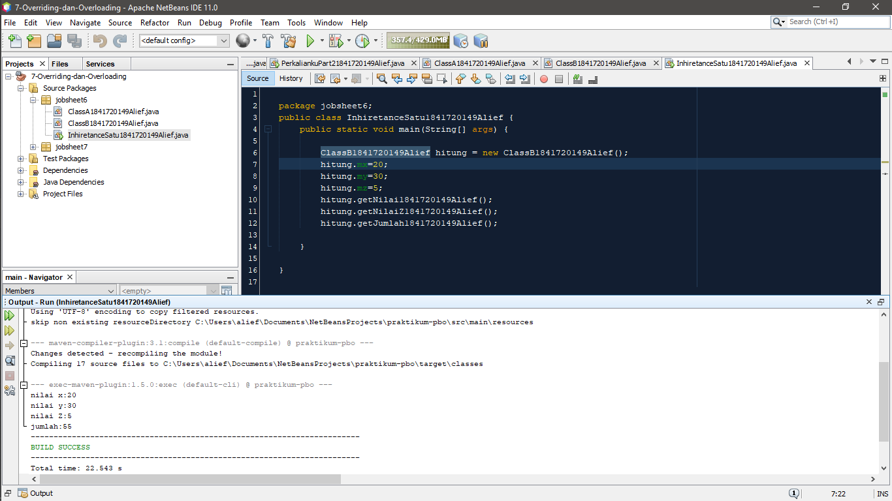
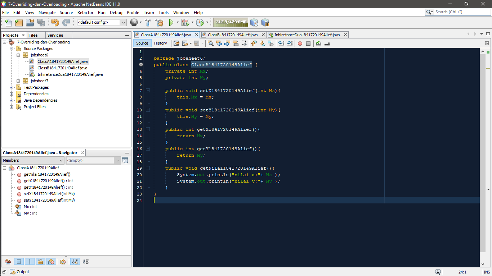
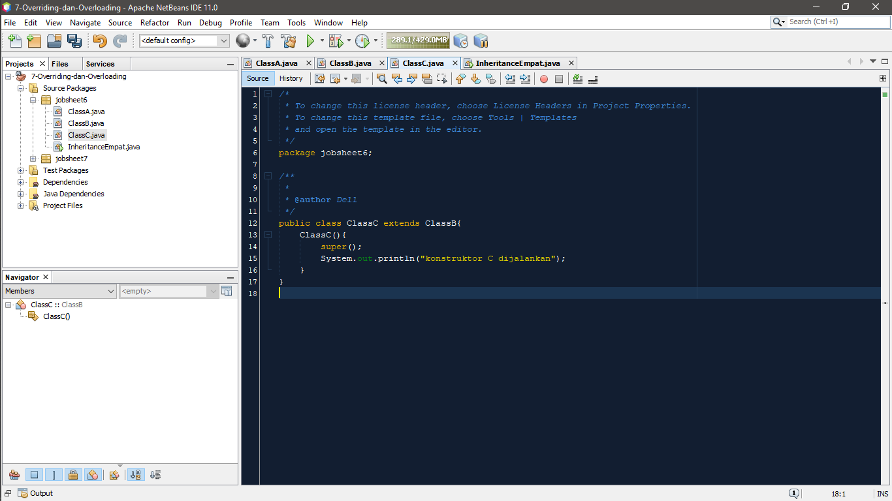
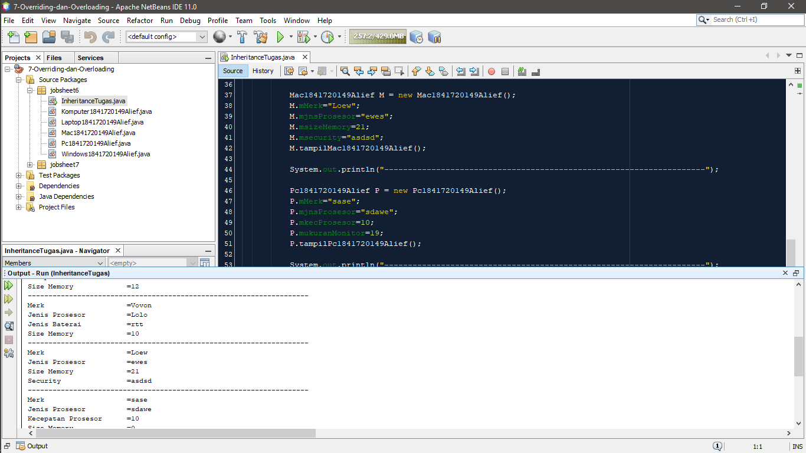

# Laporan Praktikum #6 - Inheritance (Pewarisan)

## Kompetensi

1. Memahami konsep dasar inheritance atau
pewarisan.
2. Mampu membuat suatu subclass dari suatu superclass
tertentu.
3. Mampu mengimplementasikan konsep single dan
multilevel inheritance.
4. Mampu membuat objek dari suatu subclass dan melakukan pengaksesan terhadap atribut dan
method baik yang dimiliki sendiri atau turunan dari superclass nya.

## Ringkasan Materi
Mewariskan kepada keturunan dari suatu class atau subclass yang awalnya umum menjadi lebih spesifik atau sifatnya reusable. Konsepnya sama seperti kita mendaur ulang bahan plastik maupun kertas.

## Percobaan

### Pertanyaan Percobaan 1
1. Pada percobaan 1 diatas program yang dijalankan terjadi error, kemudian perbaiki sehingga program tersebut bisa dijalankan dan tidak error!

    Jawaban : 
    
    **Kode class A** : [classA.java](../../src/6_Inheritance/percobaan1/ClassA1841720149Alief.java)

    **Kode class B** : [classB.java](../../src/6_Inheritance/percobaan1/ClassB1841720149Alief.java)

    **Kode main class** : [inheritensatu.java](../../src/6_Inheritance/percobaan1/InhiretanceSatu1841720149Alief.java)

2. Jelaskan apa penyebab program pada percobaan 1 ketika dijalankan terdapat error!

    Jawaban : Karena tidak ada extends.

### Pertanyaan Percobaan 2
1. Pada percobaan 2 diatas program yang dijalankan terjadi error, kemudian perbaiki sehingga program tersebut bisa dijalankan dan tidak error!

    Jawaban: 

    **Kode class A** : [classA.java](../../src/6_Inheritance/percobaan2/ClassA1841720149Alief.java)

    **Kode class B** : [classB.java](../../src/6_Inheritance/percobaan2/ClassB1841720149Alief.java)

    **Kode class main** : [inheritencedua.java](../../src/6_Inheritance/percobaan2/InhiretanceDua1841720149Alief.java)

2. Jelaskan apa penyebab program pada percobaan 1 ketika dijalankan terdapat error! 

    Jawaban : Pada getJumlah, pengambilan method masih salah.
    
### Pertanyaan Percobaan 3
1. Jelaskan fungsi “super” pada potongan program berikut di class Tabung!

    Jawaban : Merujuk/mengakses atribut dari parent class superclass.

2. Jelaskan fungsi “super” dan “this” pada potongan program berikut di class Tabung!

    Jawaban : “This” menyatakan argument sedangkan “Super” menyatakan argument hanya untuk public dan protected.

3. Jelaskan mengapa pada class Tabung tidak dideklarasikan atribut “phi” dan “r” tetapi class tersebut dapat mengakses atribut tersebut!

    Jawaban : Karena phi & r sudah mewakili seluruh class dalam package.

### Pertanyaan Percobaan 4
1.Pada percobaan 4, sebutkan mana class yang termasuk superclass dan subclass, kemudian jelaskan alasannya!

Jawaban : Superclass = Konstruktor SubClass konstruktor = b, c. 
Super class diwarisi sebagai kelas induk, kalau Subclass adalah kelas turunan atau class anak.

 
2.Ubahlah isi konstruktor default ClassC seperti berikut:

Tambahkan kata super() di baris Pertama dalam konstruktor defaultnya. Coba jalankan kembali class Percobaan4 dan terlihat tidak ada perbedaan dari hasil outputnya!

Jawaban : 

Output yang dihasilkan **Kode class A** constclassA.javaassC **Kode class B** septhA poclassB.javaris kedua dalam konstruktor defaultnya dan terlihat ada error. Kemudian kembalikan super() kebaris149Aliefseperti sebelumnya, maka errornya akan hilang. Perhatikan hasil kelua **Kode class main** an4 inheritencedua.javaa bisa tampil output seperti berikut pada saat instansiasi objek test dari class ClassC?
Jelaskan bagaimana urutan proses jalannya konstruktor saat objek test dibuat!

Jawaban : 

Turunan dari konstruktor C ke konstruktor B dari Konstruktor B ke Konst**Kode class A**i suclassA.javaan program d**Kode class B**ban classB.javaunakan untuk memanggil konstruktor dari superclass atau menjadi variabel yang mengacu pa149Alieflas**Kode class main**obaainheritencedua.javalass mana yang termasuk super class dan sub class dari percobaan 1 diatas!

    Jawaban: Super Class = Karyawan
Sub Class = manager, Staff 

2. Kata kunci apakah yang digunakan untuk menurunkan suatu class ke class yang lain?

    Jawaban: Extends.

3. Perhatikan kode program pada class Manager, atribut apa saja yang dimiliki oleh class tersebut? Sebutkan atribut mana saja yang diwarisi dari class Karyawan!

    Jawaban : Atribut Tunjangan, super.gaji+tunjangan.

4. Jelaskan kata kunci super pada potongan program dibawah ini yang terdapat pada class Manager!

    Jawaban: Memanggil konstruktor dari superclass atau menjadi variabel yang mengacu pada superclass. 

5. Program pada percobaan 1 diatas termasuk dalam jenis inheritance apa? Jelaskan alasannya!

    Jawaban: Multilevel Inheritance karena pewarisan tersebut dijadikan dalam berbagai tingkatan tertentu.

### Pertanyaan Percobaan 6
1.	Berdasarkan class diatas manakah yang termasuk single inheritance dan mana yang termasuk multilevel inheritance?

    Jawaban: 
    
    Single Inheritance : Class manager.

    Multilevel Inheritance : Class staff.

2.	Perhatikan kode program class StaffTetap dan StaffHarian, atribut apa saja yang dimiliki oleh class tersebut? Sebutkan atribut mana saja yang diwarisi dari class Staff!
    
    Jawaban : Atribut Lembur dan potongan 

3.	Apakah fungsi potongan program berikut pada class StaffHarian?

    Jawaban : Untuk menggabungkan main program dengan program tersebut.

4.  Apakah fungsi potongan program berikut pada class StaffHarian?

    Jawaban: Untuk Menampilkan Data dari sub class staff.

5. Perhatikan kode program dibawah ini yang terdapat pada class StaffTetap

    Terlihat dipotongan program diatas atribut gaji, lembur dan potongan dapat diakses langsung. Kenapa hal ini bisa terjadi dan bagaimana class StaffTetap memiliki atribut gaji, lembur, dan potongan padahal dalam class tersebut tidak dideklarasikan atribut gaji, lembur, dan potongan?

    Jawaban: Karena masih termasuk multi level inheritance yang di setiap tingkatan memiliki pewarisan yang berbeda bentuknya namun hasil outputnya tetap sama.

## Tugas
1.	Buatlah sebuah program dengan konsep pewarisan seperti pada class diagram berikut ini. Kemudian buatlah instansiasi objek untuk menampilkan data pada class Mac, Windows dan Pc!

    Jawaban : 

**Kode class Inheritence main** : [inheritencemain.java](../../src/6_Inheritance/tugas/inheritanceTugas.java)

**Kode class Komputer** : [komputer.java](../../src/6_Inheritance/tugas/Komputer1841720149Alief.java)

**Kode class Laptop** : [laptop.java](../../src/6_Inheritance/tugas/Laptop1841720149Alief.java)

**Kode class Mac** : [mac.java](../../src/6_Inheritance/tugas/Mac1841720149Alief.java)

**Kode class Pc** : [pc.java](../../src/6_Inheritance/tugas/Pc1841720149Alief.java)

**Kode class Windows** : [Windows.java](../../src/6_Inheritance/tugas/Windows1841720149Alief.java)

## Kesimpulan

Mewariskan beberapa sub class dan super class dari class yang kita buat dan hanya memperluas (extend) parent class-nya saja.

## Pernyataan Diri

Saya menyatakan isi tugas, kode program, dan laporan praktikum ini dibuat oleh saya sendiri. Saya tidak melakukan plagiasi, kecurangan, menyalin/menggandakan milik orang lain.

Jika saya melakukan plagiasi, kecurangan, atau melanggar hak kekayaan intelektual, saya siap untuk mendapat sanksi atau hukuman sesuai peraturan perundang-undangan yang berlaku.

Ttd,

***(Alief Al Gaffari)***
