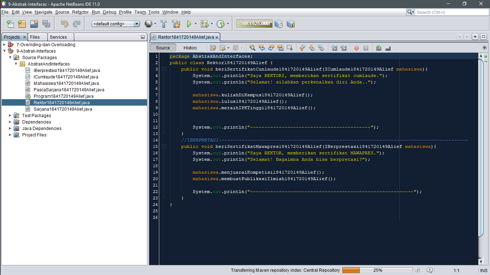
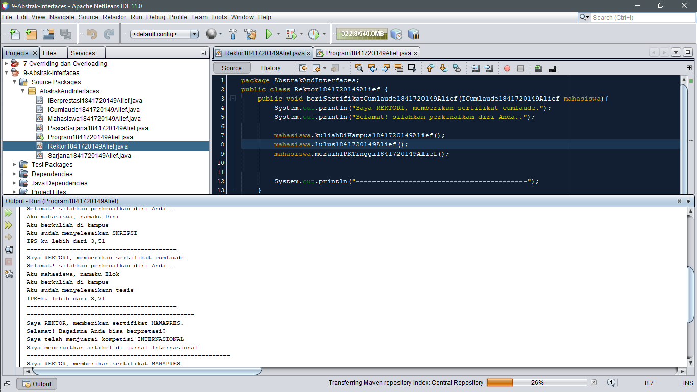

# Laporan Praktikum #9 - Overriding dan Overloading

## Kompetensi
Setelah menyelesaikan lembar kerja ini mahasiswa diharapkan mampu:
1.	Menjelaskan maksud dan tujuan penggunaan Abstract Class;
2.	Menjelaskan maksud dan tujuan penggunaan Interface;
3.	Menerapkan Abstract Class dan Interface di dalam pembuatan program.

## Ringkasan Materi
>Abstract dan Interface adalah suatu penggabungan yang bila atribut tidak dapat di instansiasi namun dapat di extend ke dalam suatu interface yang berstruktur abstract methods.

## Percobaan

### Praktikum Percobaan 1
>Bolehkah	apabila	sebuah	class	yang	meng-extend	suatu	abstract	class	tidak mengimplementasikan method abstract yang ada di class induknya? Buktikan!|
 
Jawaban :
>Tidak boleh karena abstract tidak dapat di instansiasi karena instansiasi berlaku pada main void saja, tidak pada abstract itu sendiri.

### Praktikum Percobaan 2
a.	Mengapa pada langkah nomor 9 terjadi error? Jelaskan!

Jawaban: 
>Karena include pada program tersebut tidak ada sehingga tidak terdeteksi apa yang harus digabungkan.

b.	Dapatkah method kuliahDiKampus() dipanggil dari objek sarjanaCumlaude di class
Program? Mengapa demikian?

Jawaban : 
>Bisa. Karena class Sarjana telah di extend atau digabung ke class Mahasiswa.

c.	Dapatkah method kuliahDiKampus() dipanggil dari parameter mahasiswa di method
beriSertifikatCumlaude() pada class Rektor? Mengapa demikian?

Jawaban : 
>Bisa. Karena method kuliah di campus saling berhubungan.

d.	Modifikasilah method beriSertifikatCumlaude() pada class Rektor agar hasil eksekusi class Program menjadi seperti berikut ini

Jawaban : 

**Rektor code** : 
[Rektor.java](../../src/9_Abstract_Class_dan_Interface/cobainterface/Rektor1841720149Alief.java)

### Percobaan Praktikum 3
Apabila Sarjana Berprestasi harus menjuarai kompetisi NASIONAL dan menerbitkan artikel di jurnal NASIONAL, maka modifikasilah class-class yang terkait pada aplikasi Anda agar di class Program objek pakRektor dapat memberikan sertifikat mawapres pada objek sarjanaCumlaude.
 
Jawaban : 

## Kesimpulan

>Subclass bisa diturunkan dalam satu superclass (dengan syarat ada extends). Java tidak memperbolehkan subclass diturunkan kepada superclass manapun (baik dua atau lebih) karena Java tidak bisa mendeteksi kemana hubungan subclass dengan superclass turunan yang begitu lebih dari satu.

## Pernyataan Diri

>Saya menyatakan isi tugas, kode program, dan laporan praktikum ini dibuat oleh saya sendiri. Saya tidak melakukan plagiasi, kecurangan, menyalin/menggandakan milik orang lain.

>Jika saya melakukan plagiasi, kecurangan, atau melanggar hak kekayaan intelektual, saya siap untuk mendapat sanksi atau hukuman sesuai peraturan perundang-undangan yang berlaku.

Ttd,

***(ALIEF AL GAFFARI)***
